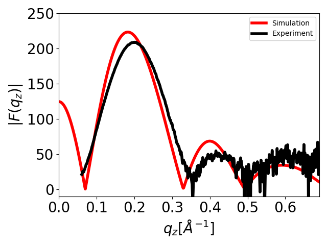
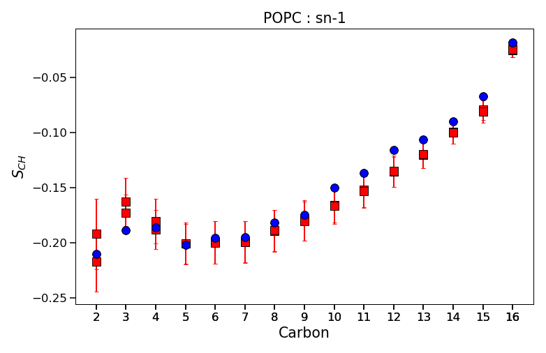
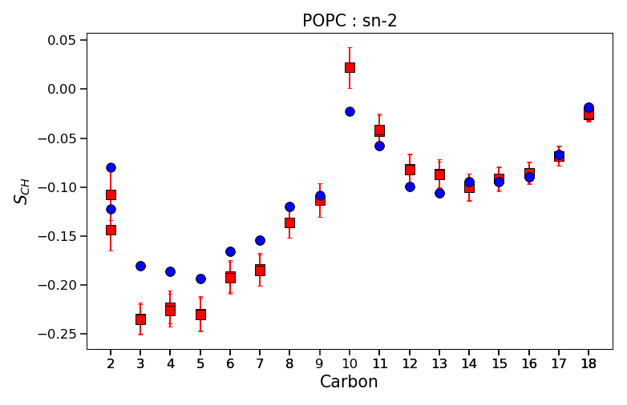
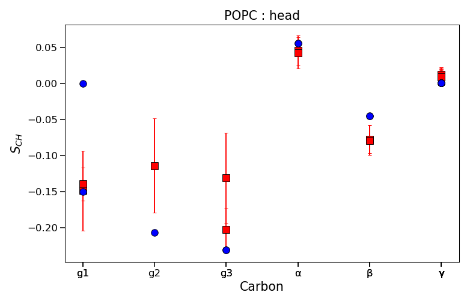

.. _plottings:

Plotting functions
==================

The functions that help visualizing data in the FAIRMD Lipids are described here. These
functions are located in the :mod:`fairmd.lipids.ipylib` submodule. Currently, the module
offers a function to plot simulation against experimental data for form factor and order
parameter.

Plotting form factors
---------------------

.. code-block:: python

   from fairmd.lipids.core import initialize_databank
   from fairmd.lipids.ipylib import plot_simulation_FF

   ss = initialize_databank()
   f = plot_simulation_FF(ss.loc(914))
   f.savefig("form_factor_914.png", dpi=300)

:func:`fairmd.lipids.ipylib.plot_simulation_FF` will produce a figure with the simulated and
experimental form factors together. Experimental data is automatically rescaled before plotting by
the scaling factor computed by function
:func:`fairmd.lipids.analib.formfactor.calc_ff_scaling_distance`. Currently, the function plots only
first experiment if there are multiple experiments associated.

Plotting order parameters
------------------------

.. code-block:: python

   from fairmd.lipids.ipylib import plot_simulation_OP

   s = ss.loc(831)
   f1,f2,f3 = plot_simulation_OP(s, "POPC")
   f1.savefig("op831a.png", dpi=92)
   f2.savefig("op831b.png", dpi=92)
   f3.savefig("op831c.png", dpi=92)

:func:`fairmd.lipids.ipylib.plot_simulation_OP` will produce three figures with the simulated and
experimental order parameters together. Carbons are named according to naming registry
(:class:`fairmd.lipids.auxiliary.opconvertor.NamingRegistry`) through the
:func:`fairmd.lipids.auxiliary.opconvertor.build_nice_OPdict` function. Currently, the plotting
function plots only first experiment if there are multiple experiments associated.

